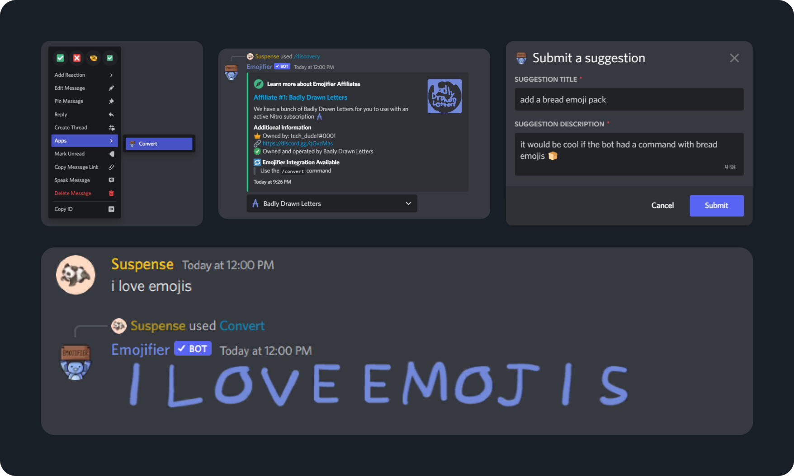

  
   
    

# Documentation
Emojifier is a Discord bot that focuses on enhancing a user's chat experience. We have many commands to help make your chatting experience fun and enjoyable.

If you have questions or concerns about Emojifier or our documentation, please join our [support server](https://discord.gg/MTwj6wG).
