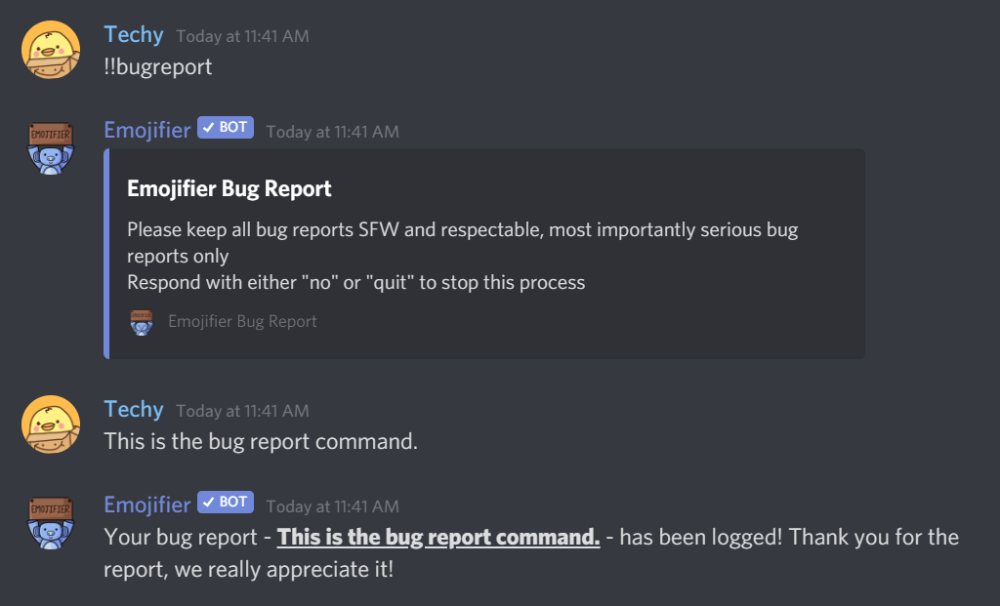

# Bug Report
---
### Description
This command is used to report a bug to the developers
### Usage
```
!!bugreport
```
### Permission Required
Anyone can use this command, unless they are blacklisted globally

### Example image


!> Abuse of this command may result in removal of bug reporting privileges
