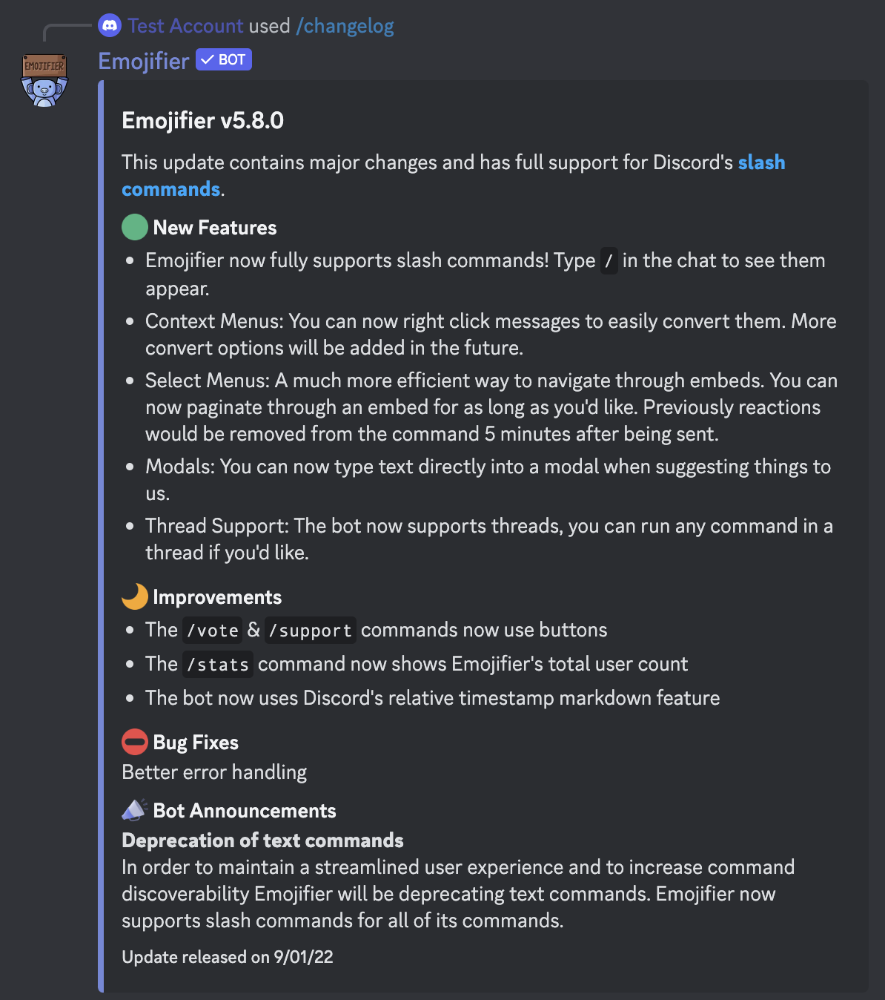

# Changelog
---
### Description
This command is used to view information about the bot's recent updates and any announcements from the developers.
### Usage
```
/changelog
```
### Permission Required
Anyone can use this command unless they are globally blacklisted.

### Example image

