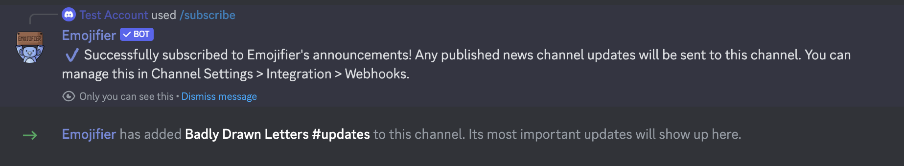
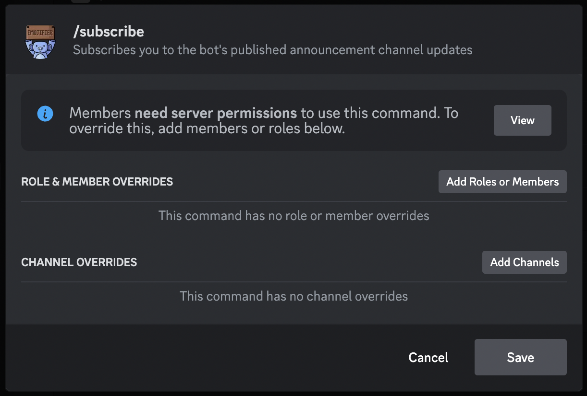

# Subscribe
---
### Description
This command is used to subscribe to Emojifiers bot updates & announcements.
### Usage
```
/subscribe
```
### Permission Required
Any user with the Administrator or Manage Server permission can use this command. However, this can be manually overriden through the bots integration settings.

### Example image



?> You must have the Administrator permission in order to edit the command permissions. Please view [this](https://support.discord.com/hc/en-us/articles/4644915651095-Command-Permissions) article for more information on command permissions.
