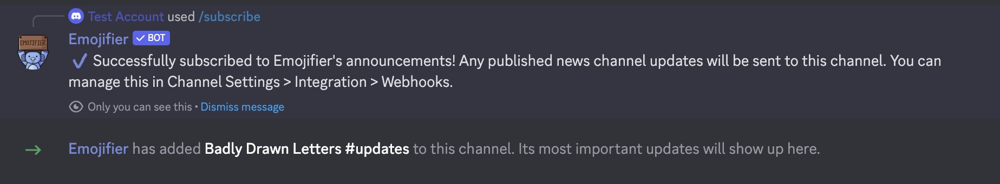
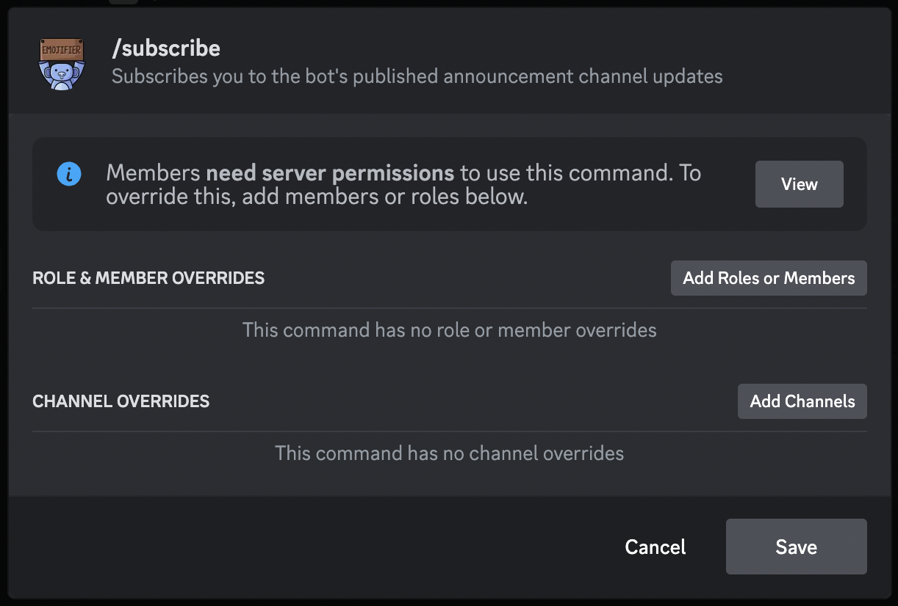

# Subscribe
---
### Description
This command is used to subscribe to Emojifier's bot updates and announcements.
### Usage
```
/subscribe
```
### Permission Required
Any user with the Administrator or Manage Webhooks permission can use this command. However, this can be manually overridden through the bot's integration settings.

### Example images



> [!IMPORTANT]
> On desktop, open **Server Settings → Integrations** and select Emojifier to edit command permissions. See [Discord's Command Permissions article](https://support-apps.discord.com/hc/en-us/articles/26501869403159-Command-Permissions) for more information.
