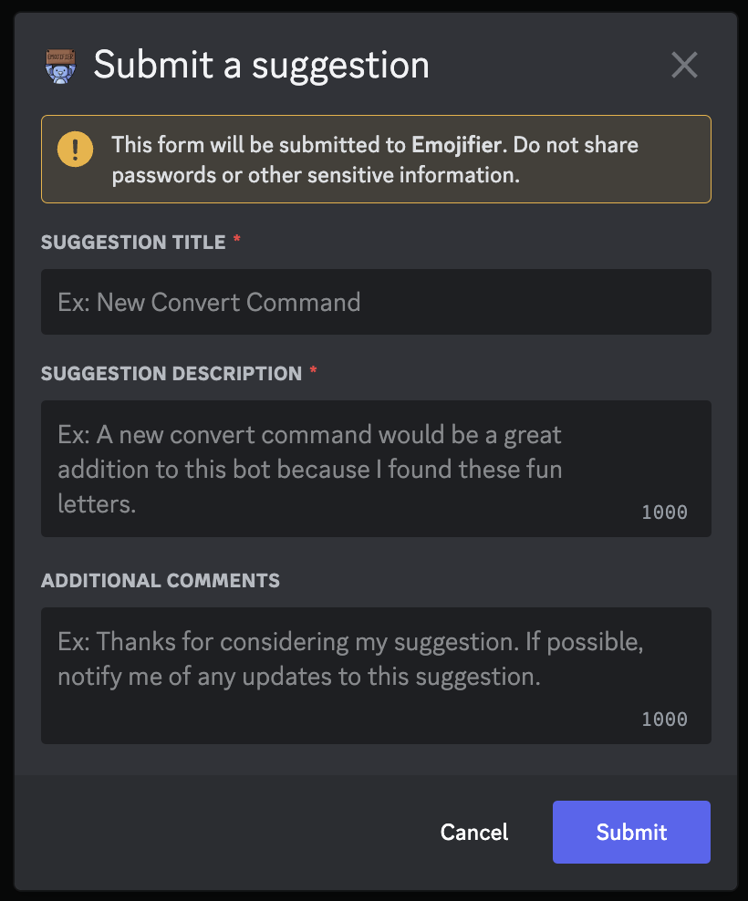

# Suggest
---
### Description
This command is used to send a suggestion to the developers.
### Usage
```
/suggest
```
### Permission Required
Anyone can use this command, unless they are blacklisted globally.

### Example image 


!> Abuse of this command may result in removal of suggestion privileges
