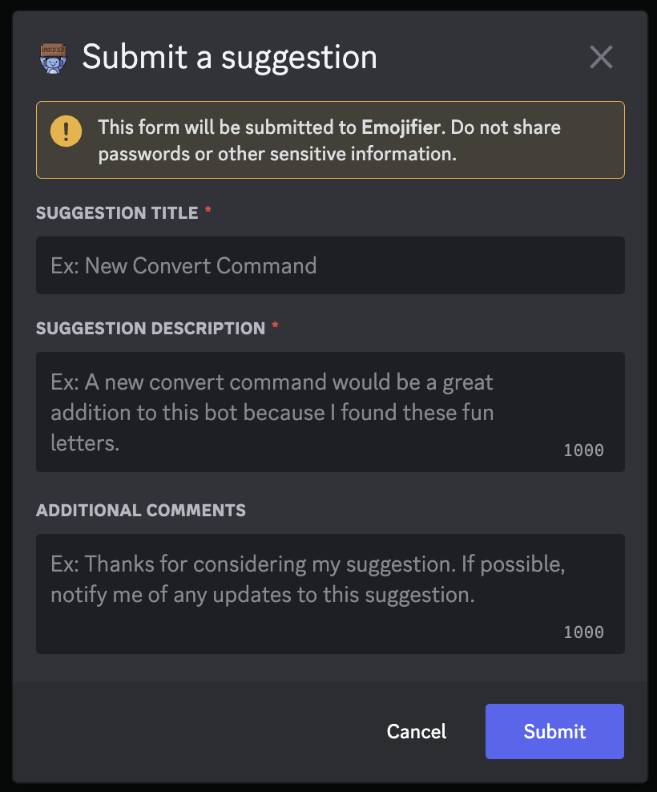

# Suggest
---
### Description
This command is used to send a suggestion to the developers.
### Usage
```
/suggest
```
### Permission Required
Anyone can use this command unless they are globally blacklisted.

### Example image


> [!CAUTION]
> Abuse of this command may result in removal of suggestion privileges.
