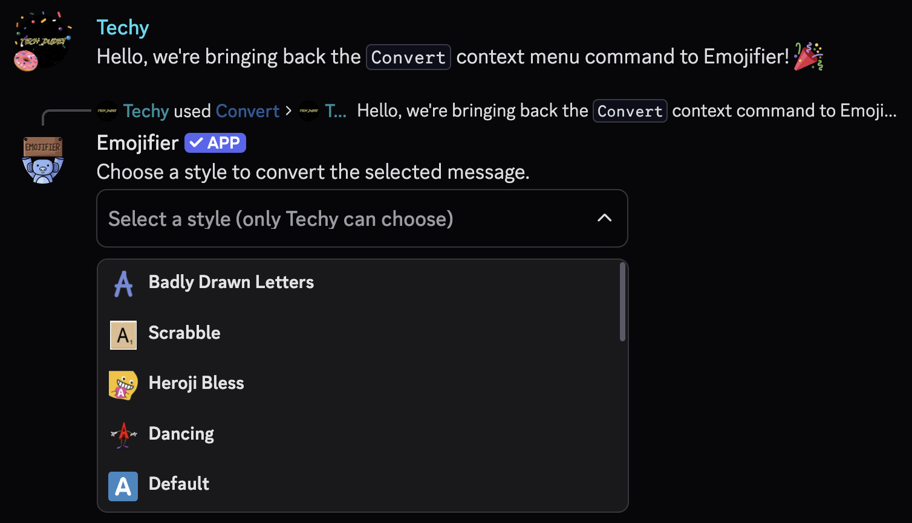

# Convert
---
### Description
This context menu command is used to convert text into your preferred emoji type.
### Usage
```
/convert
```
### Permission Required
Anyone can use this command, unless they are blacklisted globally.

### Example image


?> You must have an active [Discord Nitro](https://discord.com/nitro) subscription to use these emojis in other servers
