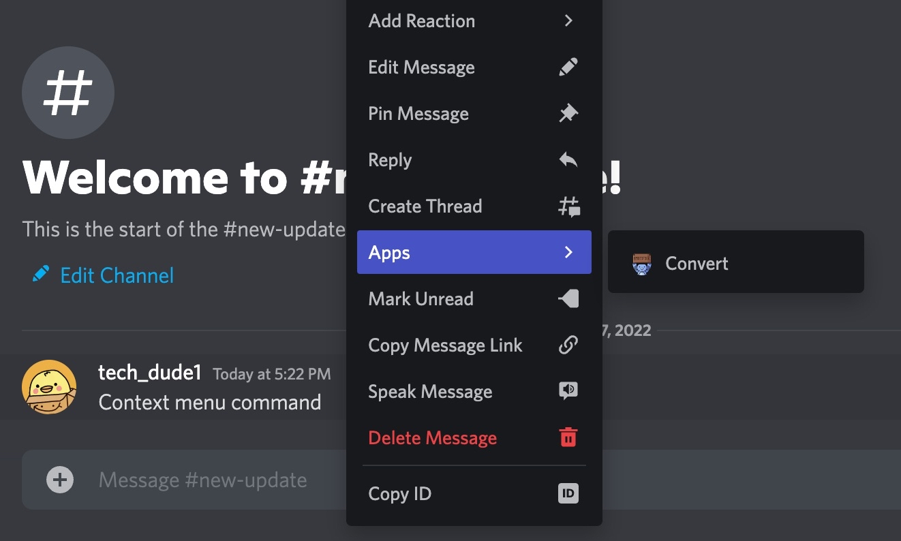
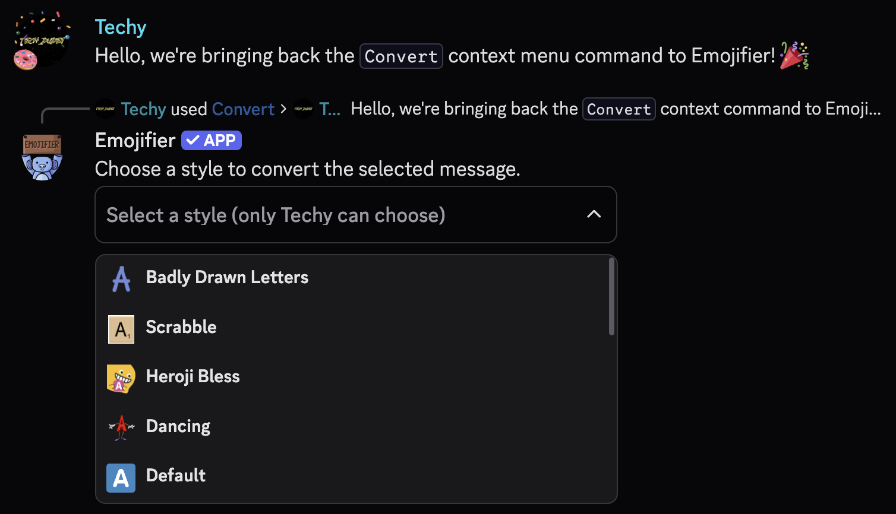

# Convert
---
### Description
This context menu command is used to convert text into your preferred emoji type.
### Usage

1. Right-click the message you want to convert.
2. Open **Apps** and select **Convert**.
3. Choose your preferred emoji style from the **Select a style** menu.

Only the person who ran the command can choose a style.

### Permission Required
Anyone can use this command unless they are globally blacklisted.

### Example images

Open the message menu and choose **Apps → Convert**:

Choose an emoji style:

> [!TIP]
> You must have an active [Discord Nitro](https://discord.com/nitro) subscription to use custom emojis in other servers.
