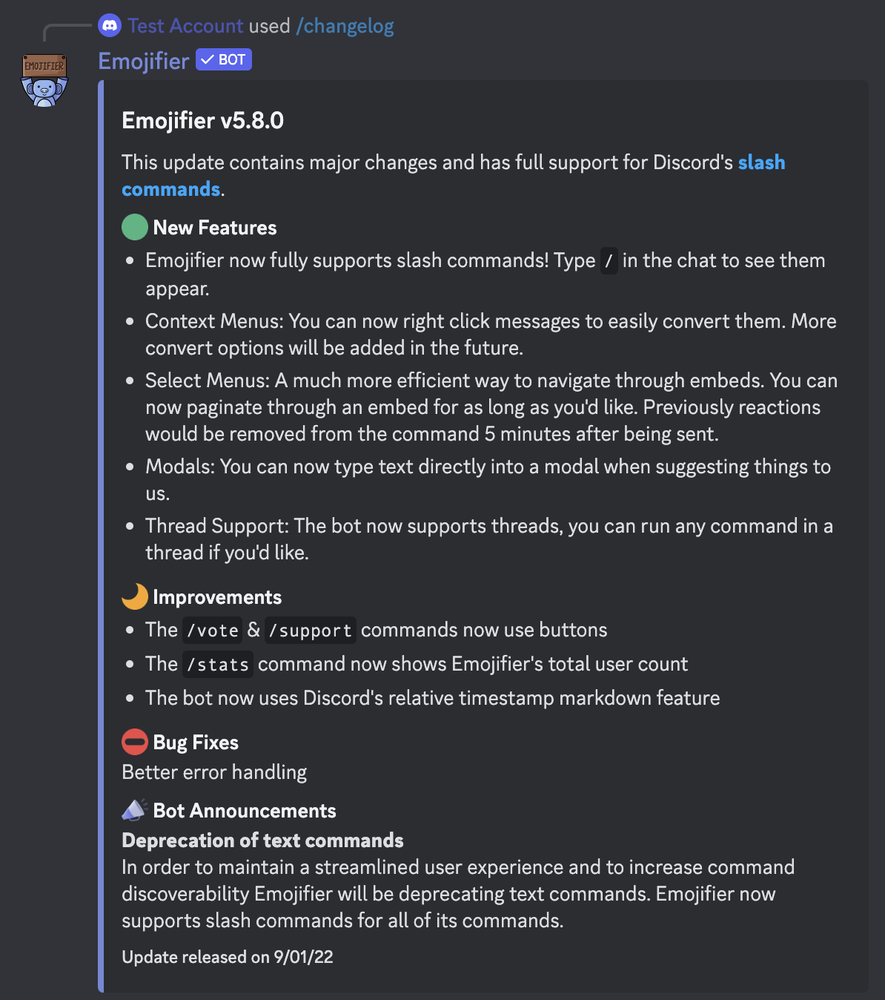

# Changelog
---
### Description
This command is used to view information about the bots recent updates and any announcements from the developers
### Usage
```
/changelog 
```
### Permission Required
Anyone can use this command, unless they are blacklisted globally

### Example image

