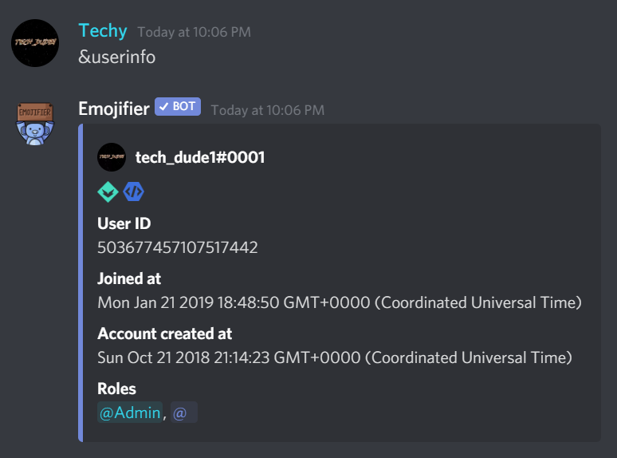

# User Info
---
### Description
Shows information about yourself or another user.

### Optional Arguments
`user` - The user you want information about, it can user ID or mention, if no arguments are provided it will default to your profile

### Usage
```
!!userinfo [user]
```

### Example image


### Permission Required
Anyone can use this command, unless they are blacklisted globally.
